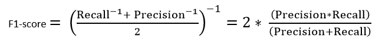

## Dataset 
The dataset used for training the classifiers was based on quality of wines, it is available [here](https://www.kaggle.com/uciml/red-wine-quality-cortez-et-al-2009). The input consists of 11 numerical variables, including:
* `fixed acidity`
* `volatile acidity`
* `citric acid`
* `residual sugar`
* `chlorides`
* `free sulfur dioxide`
* `total sulfur dioxide`
* `density`
* `pH`
* `sulphates`
* `alcohol`

The output variable `quality` is an integer between 0 and 10. 

There are 2 classifiers implemented in our solution: Support Vector Machine and Random Forest. The whole dataset consists of 1599 samples. 

We've devided the whole dataset into 3 subsets and randomly distributed 1599 samples in the following proportions:
* 10% went into `test` set,
* 10% went into `validation` set,
* 80% went into `train` set.

## Evaluation metrics
To assess our classifiers, We've used several metrics, including:
* Accuracy - simply the total number of correct predictions divided by the total number of predictions made for a dataset.
* Recall - number of the correctly identified positive predictions divided by the sum of true positive predictions and false negative predictions.
* F1 - the harmonic mean of Precision and Recall, it gives a better measure of the incorrectly classified cases than the Accuracy.

<center>



</center>

* Confusion matrix is a matrix visualizing the relationship between the predicted values and the actual values, the diagonal elements represent the number of points for which the predicted label is equal to the true label, while off-diagonal elements are those mislabeles by the classifier.

# Support vector machine
For implementing the classifiers, we used a library called [scikit-learn](https://scikit-learn.org/stable/). The hyperparameters that were taken into account while assessing the classifier's performance were:
* kernel, 
* dropout rate,
* coefficient, degree (for polynomial kernel),
* gamma.

In order to avoid overfitting on the test set, for tuning of the parameters We've used the validation set in the process of cross-validation. At first, We've picked three kernel types, including polynomial, Gaussian RBF and linear. For cross-validation, We've used the function `cross_val_score` which takes number of dataset divisions as an argument and outputs the evaluation for each subest of the division. 

* `Rbf CV accuracy: 0.48 % with the standard deviation: 0.04`  
* `Polynomial CV accuracy: 0.51 % with the standard deviation: 0.02`  
* `Linear CV accuracy: 0.54 % with the standard deviation: 0.08`


For all of the three kernels, We've chosen such hyperparameters that yielded best results, which were:  
<center>
  
Kernel    | Gamma | C | degree | coefficient |
----------|:-----:|---|:------:|:-----------:|
Polynomial|       |0.8|3       |2            |
Linear    |       |0.8|        |             |
RBF       |auto   |0.8|        |             |

</center>
  

For given set of hyperparameters, the results are:  
```python
RBF Kernel:
Accuracy:  57.50 %
Recall: 57.50 %
F1: 55.55 %
Confusion Matrix:
[ 0  0  0  3  0  0]
[ 0  0  3  0  0  0]
[ 0  0 40 32  0  0]
[ 0  0 13 51  0  0]
[ 0  0  0 13  0  0]
[ 0  0  0  5  0  0]

Polynomial Kernel:
Accuracy: 56.88 %
Recall: 56.88 %
F1: 52.41 %
Confusion Matrix:
[ 0  0  0  3  0  0]
[ 0  0  3  0  0  0]
[ 0  0 40 32  0  0]
[ 0  0 13 51  0  0]
[ 0  0  0 13  0  0]
[ 0  0  0  5  0  0]

Linear Kernel:
Accuracy: 63.12 %
Recall: 63.12 %
F1: 58.12 %
Confusion Matrix:
[ 0  0  3  0  0  0]
[ 0  0  3  0  0  0]
[ 0  0 56 16  0  0]
[ 0  0 19 45  0  0]
[ 0  0  0 13  0  0]
[ 0  0  0  5  0  0]

```
Comparing those metrics, We can observe, that the best results for the SVM classifier were obtained using the **RBF kernel**.

# Random forest
Another classifier that we've used in our excerise was Random forest classifier. Similarly like in the previous one, the implementation is from the scikit-learn library. In case of this classifier, the only hypermarameter which has been considered was `n_estimators` which represents the number of trees in the forest. After the cross-validation process, the optimal value of `n_estimators` obtained was 100. Increasing the number over 100 did not have any effect on the validation and final evaluation.

* `Random forest CV accuracy: 0.63 % with the standard deviation: 0.07`

The metrics obtained for such value of the hyperparameter were:

```python
Random forest:
Accuracy: 75.00 %
Recall: 75.00 %
F1: 73.45 %
Confusion Matrix:
[ 0  1  2  0  0  0]
[ 0  0  2  1  0  0]
[ 0  0 61 10  1  0]
[ 0  0 11 48  5  0]
[ 0  0  0  3 10  0]
[ 0  0  0  1  3  1]
```

# k-nearest neighbour classifier
The third classifier, that we've implemented was k-nearest neighbour classifier, also using the scikit-learn library. The only hyperparameter that considerably changed the obtained results was `n_neighbours` which determined the number of neighbours taken into consideration when predicting the class of the test sample. After cross-validation, the best results were obtained for `n_neighbours = 5`.

* `KNN CV accuracy: 0.44 % with the standard deviation of: 0.02`

The evaluation for the setup above was: 

```python
K-Nearest neighbors:
Accuracy: 43.75 %
Recall: 43.75 %
F1: 42.70 %
Confusion Matrix:
[ 0  0  1  2  0  0]
[ 0  0  2  1  0  0]
[ 0  2 35 34  1  0]
[ 0  0 27 28  9  0]
[ 0  0  2  4  7  0]
[ 0  0  0  2  3  0]
```

# Final remarks
Although for each type of classifier, we've managed to extract such setups (hyperparameters) that were performing best in most situations, it is important to note, that the overall results were fluctuating over each iteration. This indicates, that the performance of the classifiers was highly dependent on the division of the dataset (as it was randomly distributed in each iteration). Comparing all the used classifiers, it was clear, that the best performance overall was provided by the **Random forest** classifier.