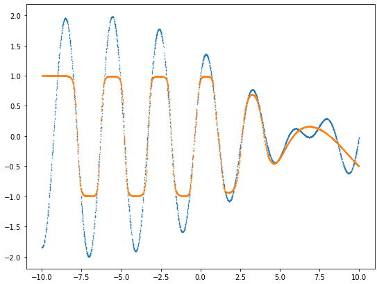
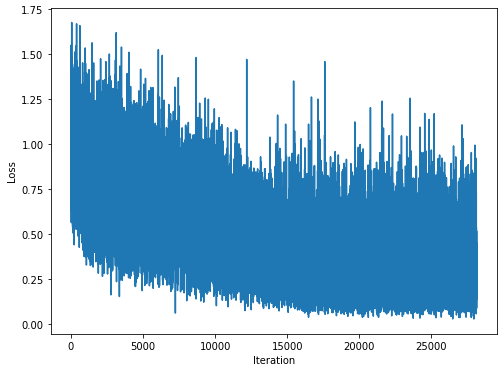

## Exercise 7 - two-layer perceptron

### Function
The function we wanted to represent with our network has the following form:

&space;=&space;sin(x\cdot&space;\sqrt{4})&space;&plus;&space;cos(x\cdot&space;\sqrt{5}))

### Implementation
In order to implement our network, we've used `PyTorch` library. We've randomly generated the dataset, consisting of uniformly distributed points of the above function in range `[-10, 10]`. We've generated **30000** samples for the train set, **4000** samples for the validation set and **4000** samples for the test set. After implementing the learning procedure, we've tried many different values of hyperparameters along with different kinds of activation functions. The best suited activation function for our network turned out to be **hyperbolic tangent**. The hyperparameters that we've changed were: 
* number of connections between layers,
* batch size, 
* learning rate, 
* number of epochs.

In order to establish hyperparameter values, we've used the validation dataset. At the end of each epoch we've checked if the validation loss is decreasing. After several runs, we've come up with a set of hyperparameters.

The final values that yielded the best results were: 
* `number of connections between layers = 128`,
* `batch size = 32`,
* `learning rate = 1e-2`,
* `number of epochs = 30`.

The results obtained for the above setup can be seen on the plots below:
  
where the **blue** plot is the actual function and the **orange** plot is the prediction of our network.

The loss function corresponding to the prediction was as follows:  
  
where on the x-axis the number of batches that went through the network can be seen and on the y-axis the corresponding loss values. 

## Run instructions
In order to run the code, Python 3 is required with JuPyter notebook environment installed. Alternatively, [Google colab](https://colab.research.google.com/) can be used to provide runtime environment. All the cells in the notebook have to be ran from top to the bottom.